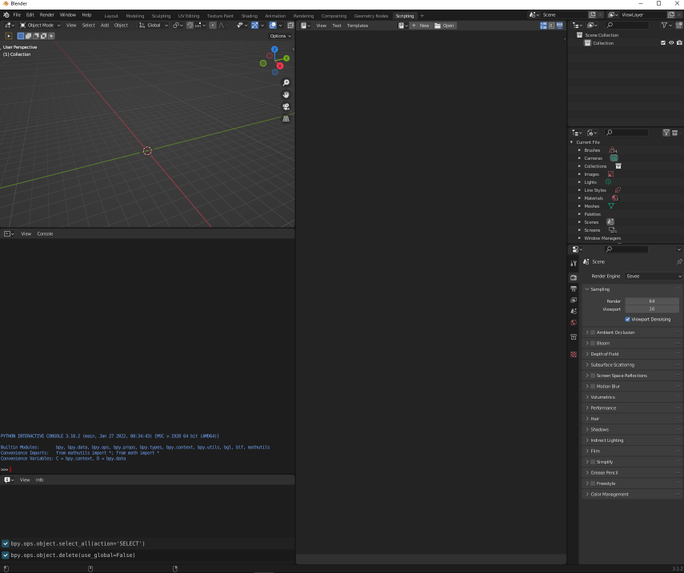
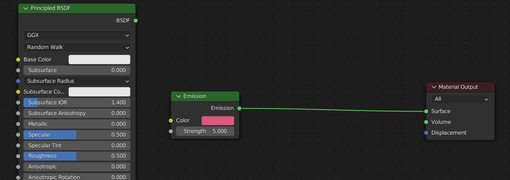

# Blender Plugin Tutorial

In this course you will learn how to use Python in Blender and then how to create a basic plugin.

> This tutorial was made in 3.1.2 Blender version.

---

Open new project, select general, press A, then X.
Now we have an empty project but there is one more thing - click *Edit* -> *Interface* -> *Display* and make sure *Python Tooltips* option is enabled.

Now navigate to the *Scripting* tab. Here by default 3 new sections should appear - Python console, Info (displays every Python function that is executed when using Blender) and text editor.

In *Render Properties* (camera icon in the bottom right panel) when using Eevee makes sure to enable **Bloom**.

Click on Python Console section and type 

    print('test')
    
Here you can execute any python code. 

## Basic operations

For that we use **bpy** - Blender Python library. In console type: 

    bpy.
    
and press tab. Blender will show you all available options.

    bpy.ops.mesh.primitive_cube_add()

In the viewport new cube should appear.
When you added this cube it was marked as active. If you click somewhere in the viewport away from the cube, it is no longer active object. So lets use that right after we add cube, it is active.

    a = bpy.context.active_object

Now variable *a* contains an active object that was selected when this line was executed. *a* will still reference that object even when it is no longer marked as active.

How to change cube's location?
Our cube has 3 coordinates - x, y and z. They can be accessed this way:

    a.location

Lets modify x coordinate, execute:

    a.location[0] = 5

Cube moved 5 units on the x axis.

## Creating cube grid

Now lets delete the cube and click on the *New* button in *Text Editor* section. This creates a new python file that you can later export.

We will be creating a unique square grid of cubes that will be generated based on user's input value.
I will begin by importing required libraries and creating two new materials.
The code below will check if a materials with a given names exist. If they don't, new materials will be created.

    import bpy
    import random

    if "material_red" not in bpy.data.materials:
        # create new material
        red_mat = bpy.data.materials.new(name = "material_red")

        # using nodes for connecting emission shader
        red_mat.use_nodes = True
        nodes = red_mat.node_tree.nodes

        material_output = nodes.get("Material Output")

        # creating and setting values of emission shader
        node_emission = nodes.new(type = "ShaderNodeEmission")
        node_emission.inputs[0].default_value = (0.7, 0.1, 0.2, 1)
        node_emission.inputs[1].default_value = 5

        # connecting emission shader to the material
        links = red_mat.node_tree.links
        red_mat_link = links.new(node_emission.outputs[0], material_output.inputs[0])

    if "material_steel" not in bpy.data.materials:
        # creating material and setting its properties
        steel_mat = bpy.data.materials.new(name = "material_steel")
        steel_mat.metallic = 1.0
        steel_mat.roughness = 0.0

This is how the *material_red* looks like in the Shading tab.

As you can see Principled BSDF was disconnected in order to connect Emission that makes our cube glow.

After material setup lets add some cubes to our scene.

    size = 10
    spacing = 2.2

    for x in range(size):
        for y in range(size):
            # calculate location
            location = (x*spacing, y*spacing, random.random()*3)

            # add cube
            bpy.ops.mesh.primitive_cube_add(size=2, enter_editmode=False, align='WORLD', location=location, scale=(1, 1, 1))
            
            # select the cube
            item = bpy.context.object
            
            # choose a material for the cube
            if random.random() > 0.02:
                item.data.materials.append(bpy.data.materials["material_steel"])
            else:
                item.data.materials.append(bpy.data.materials["material_red"])

## Creating and add-on

Now go to *Text Editor* -> *Templates* -> *Python* -> *Operator Simple*.

We need to perform these steps:
- paste all of our previous code into the main function (remove *size* variable assignment and change *context* argument to *size*)
- add `from bpy.props import *`
- add these options to simple operator class:
`bl_options = {'REGISTER', 'UNDO'}`
- add this property into the simple operator class:
    
    `square_size: IntProperty(
        name = "Square Size",
        description = "Size of the square grid.",
        default = 2,
        min = 1,
        max = 10
    )
    `
- in the execute function chnage main call to `main(self.square_size)`
- change last line to `bpy.ops.object.simple_operator()`

In the end your code should look similar to [this code](./square_grid.py).
Save the file, then press F3, search for Simple Object Operator, click it and a little box should appear where you can change definied properties (in this case square size).

## ***Extra*** - Importing HDRIs

Go to *Shading* tab, select world in *Shader Editor* (panel at the bottom). Press Ctrl+A and search for *Environment Texture*.
Then connect color to color. Click open in *Image Texture* node and search for your HDRIs.
You can download nice HDRIs from [here](https://polyhaven.com/).

# Summary

Scripting in Blender is pretty powerful, you can create amazing and much more advanced things. This was just a quick overview so do not worry if you feel overwhelmed. If you didn't really undertand creating materials I encourage you to check out *Shading* tab and play with it. We also used Simple Operator - you can think of it like template for our code to make it more pleasurable to use.
If you continue to learn blender, these concepts will become more familiar and you can come back to this code.

I wish you good luck on your Blender learning path.
Have an astonishing day!

*Lucas Hazardous*